# Visualization-Driven Analysis of the World Happiness Dataset
---

## 📌 Project Overview

This project presents a **visualization-driven analysis** of the World Happiness Report dataset.

Unlike traditional approaches that rely heavily on statistical modeling, this work focuses on:
- Interpretability  
- Comparative analysis  
- Visual storytelling  

We analyze **158 countries across 12 key variables** using advanced visualizations such as:
- Correlation matrices  
- Ridgeline plots  
- Choropleth maps  
- Sankey diagrams  

The goal is to uncover **patterns, outliers, and key drivers of global happiness**.

---

## Why This Dataset?

The World Happiness dataset combines **economic and social indicators**, including:
- GDP per capita  
- Family support  
- Health (life expectancy)  
- Freedom  
- Trust (government corruption)  
- Generosity  

### Objectives
- Identify global inequalities and regional disparities  
- Understand relationships between money, health, and social support  
- Communicate insights in an intuitive, visual way  

---

*We would suggest going through the notebook for the visualizations since they're interactive.*

##  Visualization Gallery & Insights

### 1. Correlation Matrix
- Strongest correlations: **Economy, Family, Health**
- Weakest correlations: **Trust, Generosity**
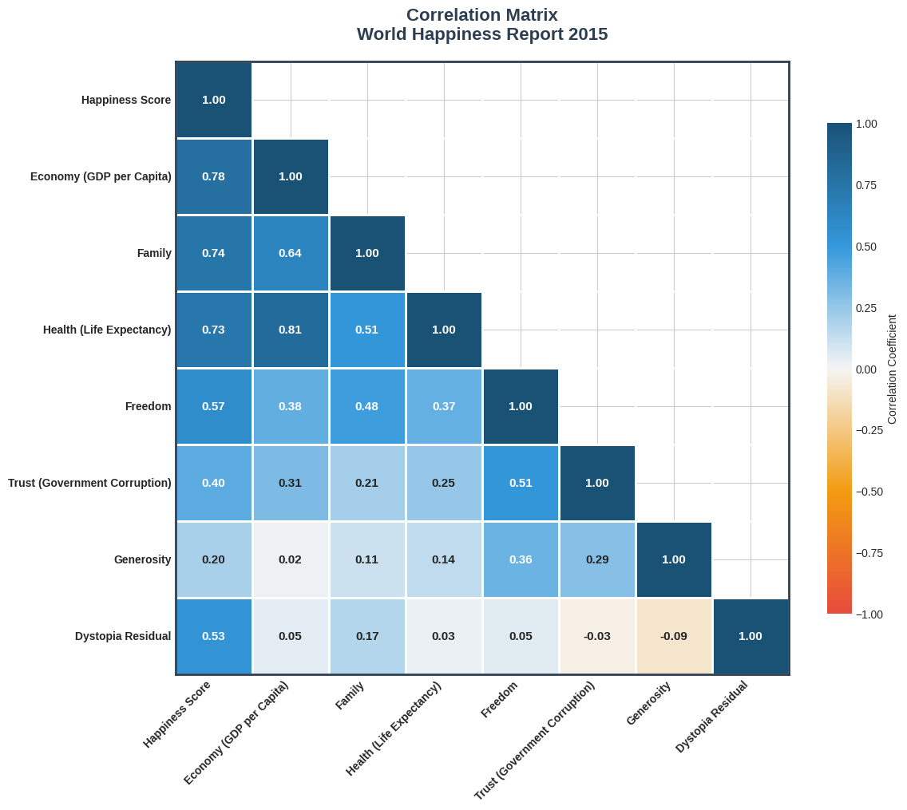

**Key Insight:**  
Financial stability, social support, and life expectancy are the core pillars of happiness.

---

### 2. Horizontal Bar Chart
- GDP (0.78) → highest correlation  
- Family (0.74), Health (0.73) follow  
- Generosity → lowest impact  
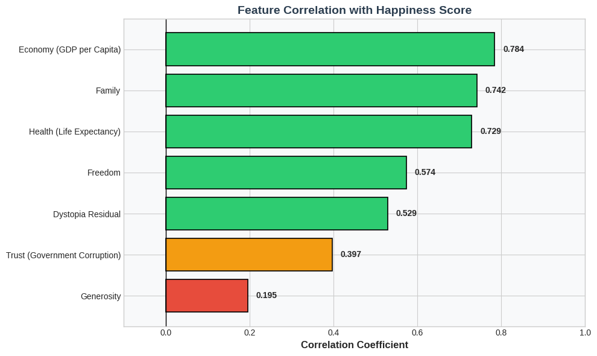

**Key Insight:**  
Basic needs outweigh voluntary behaviors in determining happiness.

---

### 3. Ridgeline Plot
- Western Europe & Oceania → highest and most consistent happiness  
- Sub-Saharan Africa → lowest and most variable  
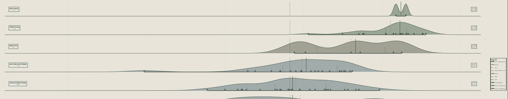

**Key Insight:**  
Significant regional inequality exists in wellbeing.

---

### 4. Lollipop Chart (Top vs Bottom Countries)
- Switzerland: +2.21 above global mean  
- Togo: -2.54 below global mean  
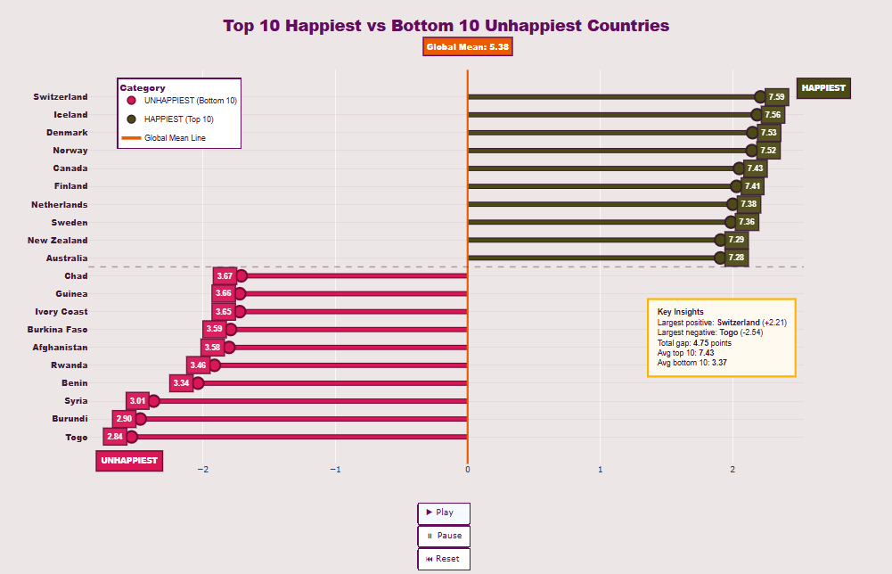

**Key Insight:**  
There is a massive gap between the happiest and least happy nations.

---

### 5. 3D Scatterplot
- Strong upward trend: Wellbeing vs Happiness  
- Weak correlation: Economic Dependency  
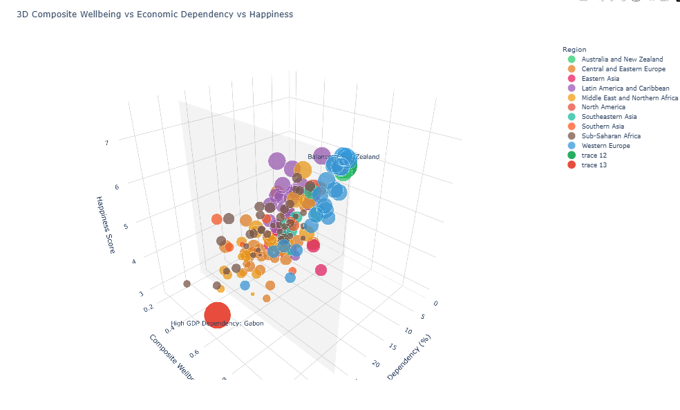

**Key Insight:**  
Outliers (e.g., Gabon, New Zealand) challenge general trends.

---

### 6. Pairplot
- Strong linear relationships observed  
- Economy ↔ Health correlation: **0.81**
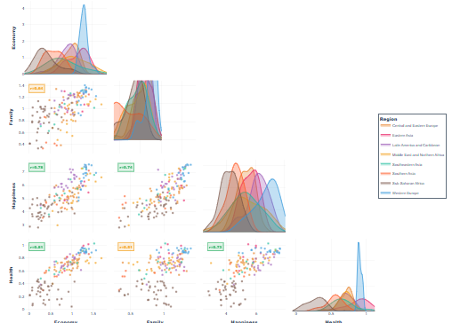

**Key Insight:**  
Wealthier countries tend to have healthier populations.

---

### 7. Choropleth Map
- High happiness: Western Europe, North America  
- Low happiness: Sub-Saharan Africa, conflict regions  
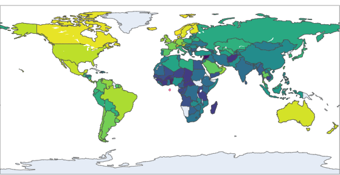

**Key Insight:**  
Happiness is geographically clustered.

---

### 8. Bubble Chart
- Rising GDP + Health → Higher Happiness  
- Larger bubbles = stronger combined effects  
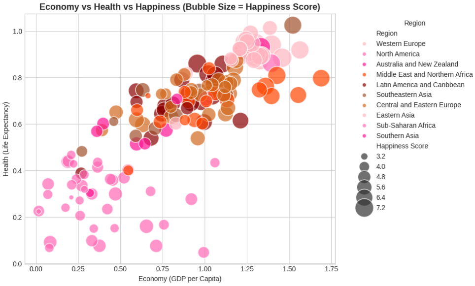

**Key Insight:**  
Happiness is driven by combined socioeconomic factors.

---

### 9. Icicle Chart
- Western Europe dominates total happiness contribution  
- Uniform block sizes → consistency  
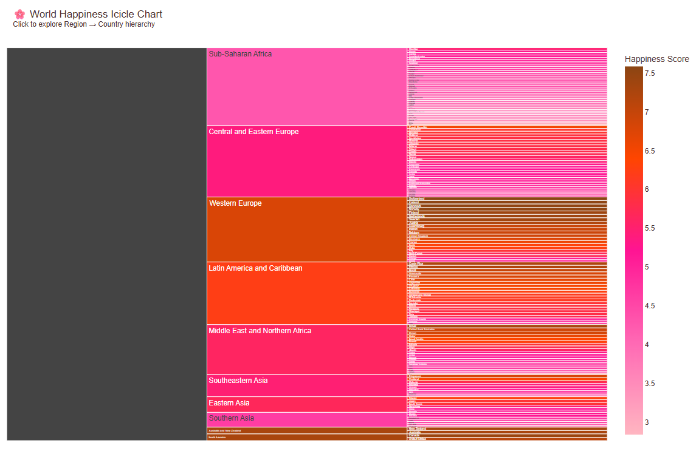

**Key Insight:**  
Some regions maintain stable high wellbeing across countries.

---

### 10. Radial Heatmap
- Top countries → strong Economy & Health  
- Variability in Trust & Generosity  
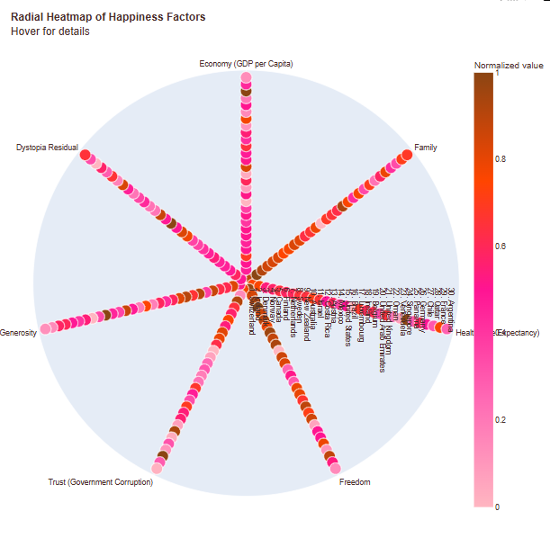

**Key Insight:**  
Trust and generosity differentiate top-performing countries.

---

### 11. Sankey Diagram
- Family is the strongest driver (51 countries)  
- Most countries fall into “Moderate” happiness  
- Western Europe dominates “High” category  
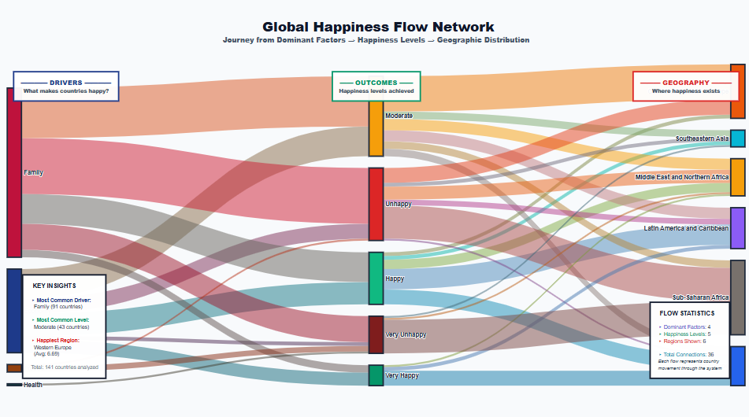

**Key Insight:**  
Social support plays a central role globally.

---

##  Conclusion

This analysis highlights three major findings:

- **Core Drivers:** Economy, Health, and Family are the strongest contributors  
- **Regional Disparity:** Western Europe leads; Sub-Saharan Africa lags  
- **Outliers Matter:** Countries like Gabon and New Zealand show that happiness is multi-dimensional  

---

##  Tech Stack

- Python  
- Pandas  
- Matplotlib / Seaborn  
- Plotly  
- Data Visualization Techniques  

---

##  Dataset

- World Happiness Report Dataset (158 countries, 12 variables)

---

## 💡 Key Takeaway

This project demonstrates how **data visualization transforms raw data into meaningful insights**, making complex global patterns easier to understand and communicate.

---
By: aleesha-10, 